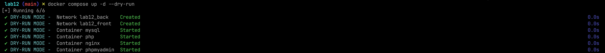
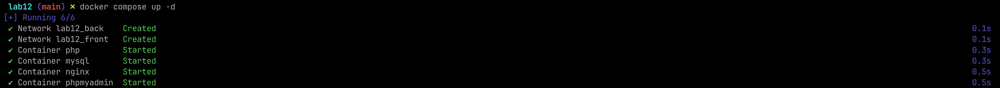
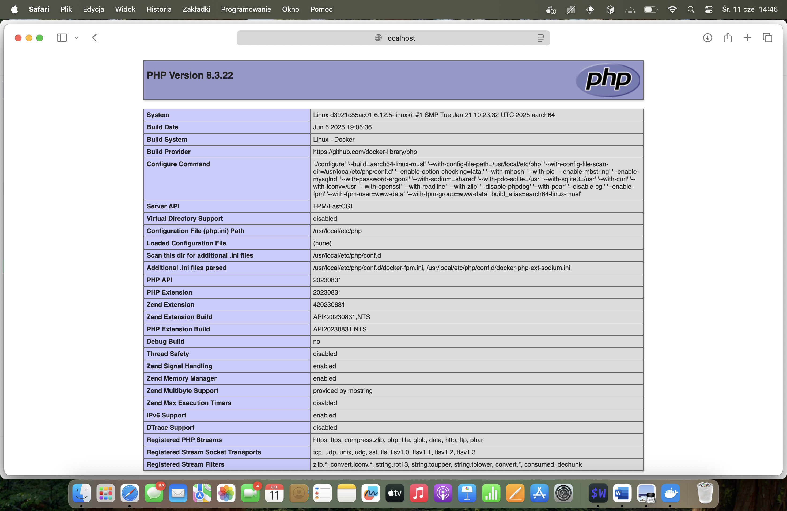
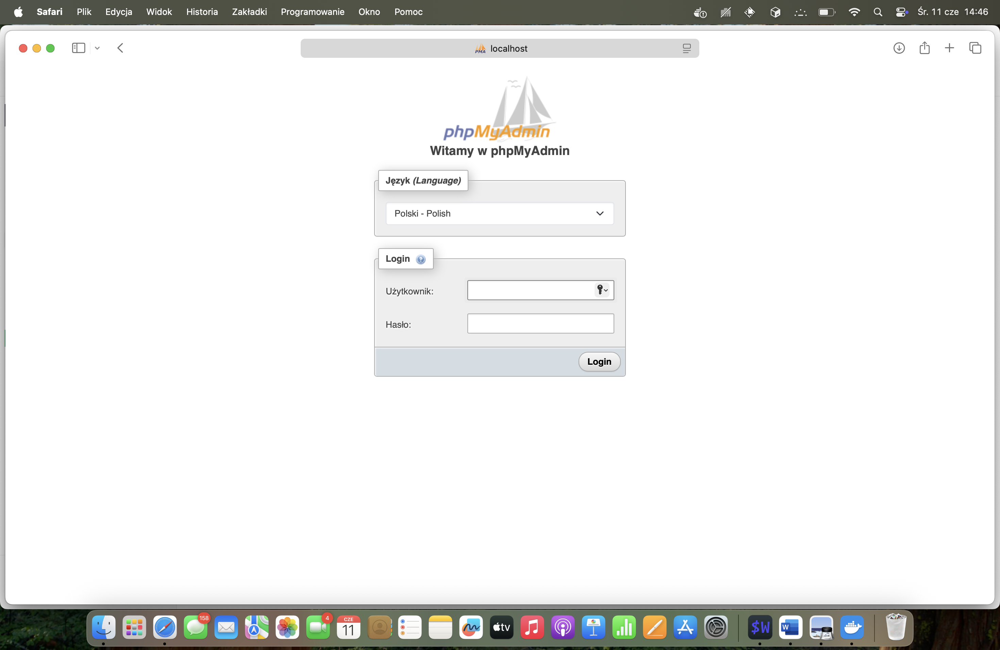
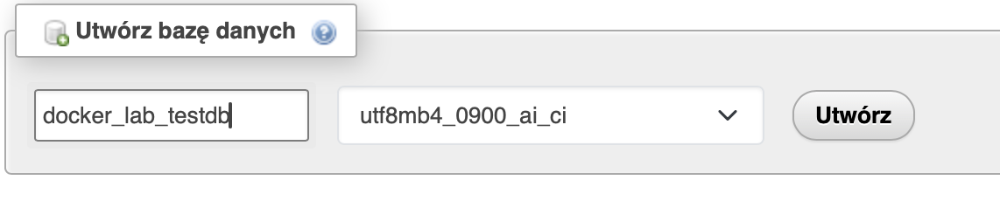
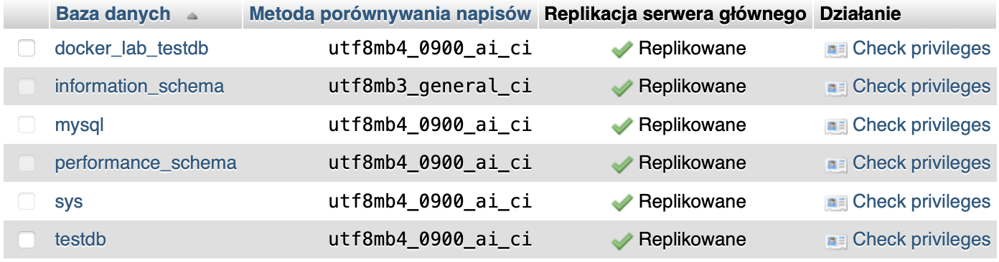
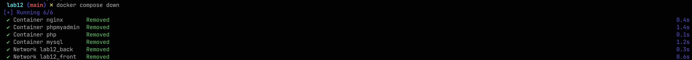

# A Docker Compose container created for the twelfth laboratory in cloud computing programming.

LEMP - web stack created for solutions written in PHP that support the SQL database

---

## Table of Contents

- [Screenshots](#screenshots)
- [Short info](#information)
- [Installation](#installation)
- [Usage](#usage)

---

## Screenshots















---

## Information

- MySQL and PHP are on the backend network because they only communicate with each other (PHP connects to MySQL)
- Nginx acts as the frontend and needs access to PHP (backend) as well as to be exposed to the outside world
- phpMyAdmin must connect to MySQL (therefore, it needs access to the backend network) and also be accessible from a browser (so it needs the frontend network)

## Installation

```bash
git clone https://github.com/MedrekIT/cloud_lemp.git
cd cloud_lemp
```

> [!IMPORTANT]
> To make it work, you will need to provide your own environment variables and secrets in .env, db_password.txt and db_root_password.txt files

---

## Usage

*Test start*
```bash
docker compose up -d --dry-run
```

*Start*
```bash
docker compose up -d
```

*Test*
- [index](http://localhost:4001)
- [phpMyAdmin](http://localhost:6001)

*Stop*
```bash
docker compose down
```
